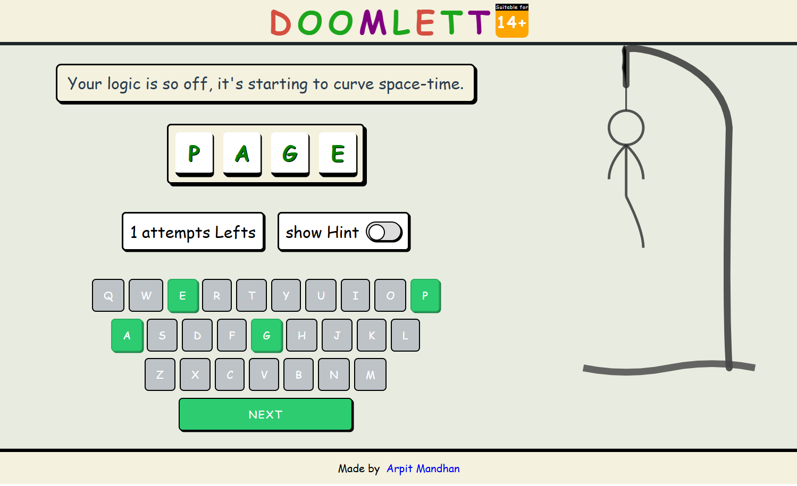

# **✨Doomed Letters **

Not Your **Grandma’s** Word Game 😏

🎯 What Is This?
Welcome to Doomed Letters – where guessing letters becomes a battle of wit, sarcasm, and style. This isn't just Letter game. This is a full-blown paper-styled word war.

Whether you're a spelling wizard or a casual guesser, this game will test your vocabulary, patience, and maybe even your pride.

## 🧩**Game Highlights**

🖊️ **Hand-Drawn UI** – Like doodling in class, but more productive

⚡ **Blazing Fast (React + Vite)** – Minimal load times, maximum fun

🎭 **Roast-Powered Gameplay** – Get roasted for every bad guess. Literally.

📱 **Fully Mobile Responsive** – Play it in bed, in class (shhh), or on the go

🛠️ **No Servers, No Mercy** – Pure frontend logic, impossible to hack

🚫 Ad-Free & Tracker-Free – Your data stays yours

## **🕹️ How It Works **
* A word is randomly chosen.

* You guess letters. Badly.

* With every wrong guess, the Doomed Letters builds.

* Keep going... or rage quit and blame the UI.

💡 Need help? Hit the “Hint” button **(if your pride allows it)**.

## 🔗 Live Demo

[Click here to play!](https://arpit-mandhan-001.github.io/Doomed-Letters/)

## 📸 Preview

## **💻 Built With**
**Framework**: React + TypeScript

**Bundler**: Vite

**Styling**: CSS (Notebook-style, because aesthetics matter)

**Hosting**: GitHub Pages

📸 Preview

## **🚧 What's Coming Next?**
🧑‍🤝‍🧑 **Multiplayer mode **(bring friends, destroy friendships)

🔊 **Sound effects** to match your frustration

🏆 **Leaderboard** to flex your wins (and Ls)

🚀 Play the Game Now
👉 Click Here to Play Doomed Letters

💡 Got Feedback?
Found a bug? Got an epic idea? Want to roast the game back?

➡️ Open an issue and let’s talk.

## **🤝 Want to Contribute?**
Got a weird idea? Or just want to make this better?
**We'd love to see it! Here's how you can contribute:**

1. Fork the repo

2. Make your changes — whether it’s fixing bugs, adding features, or just making things weirder

3. Open a pull request

***If it’s awesome, we’ll merge it in.***